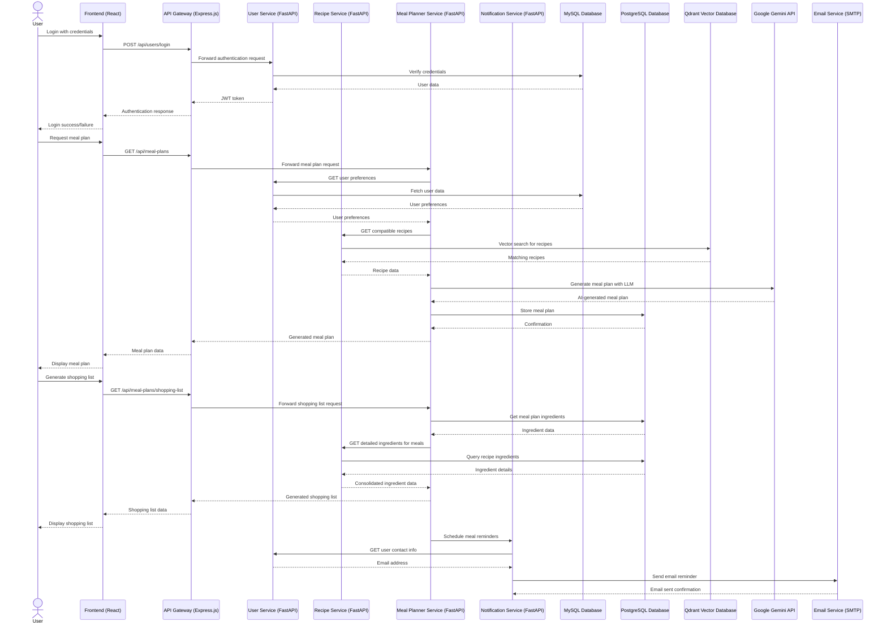
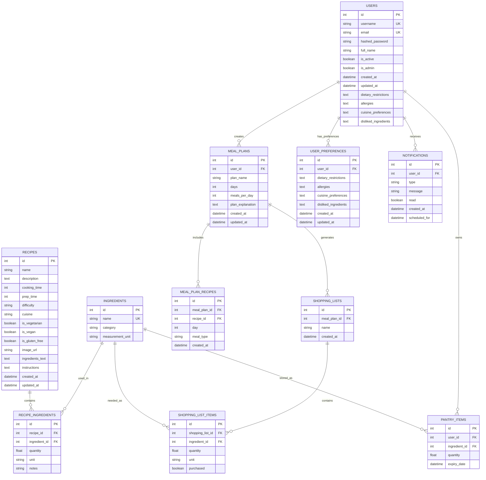
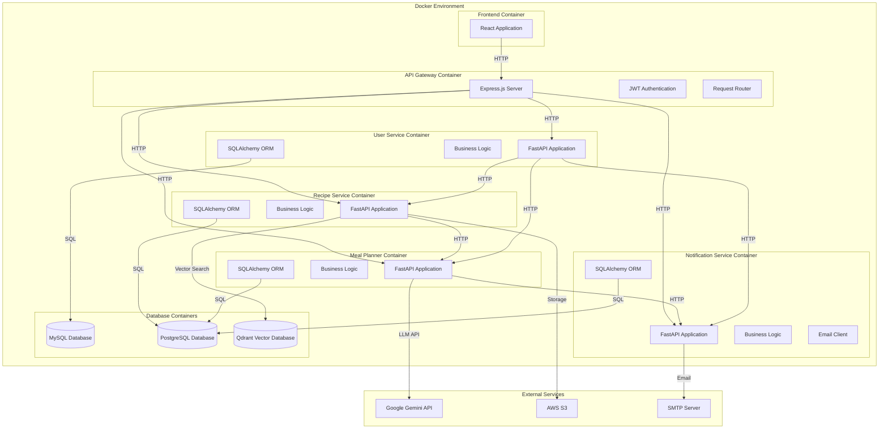
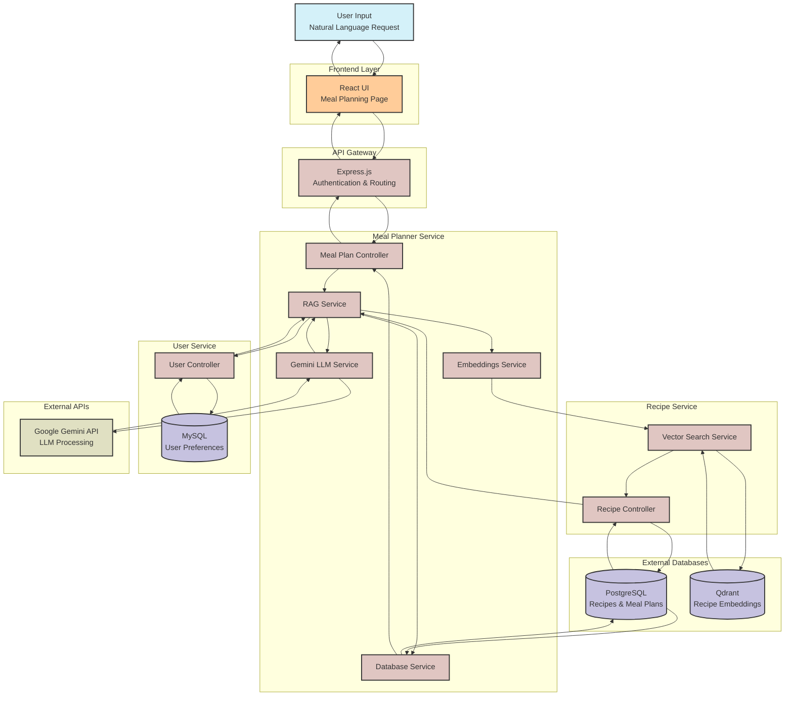
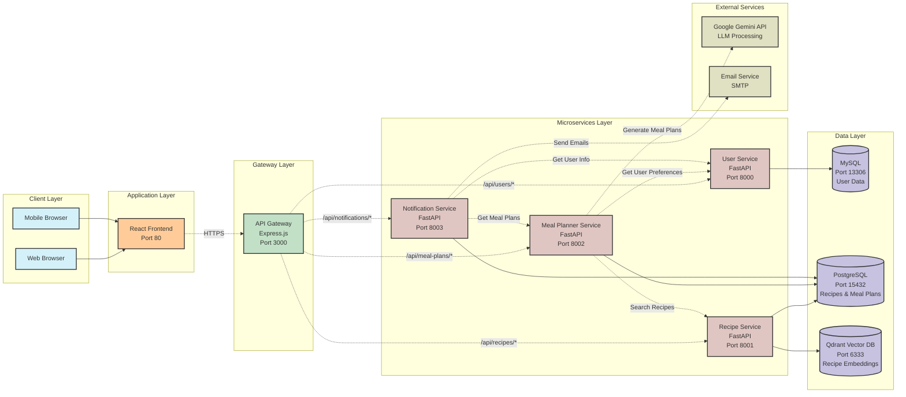

# MealMateAI Architecture Diagram

This file contains the Mermaid code for generating the MealMateAI system architecture diagram. You can view this diagram by pasting the code into any Mermaid-compatible viewer such as:

- [Mermaid Live Editor](https://mermaid.live/)
- GitHub markdown (just paste this code in any .md file)
- GitLab markdown
- VS Code with Mermaid extension

## System Architecture Diagram

```mermaid
graph TD
    %% Define styles
    classDef client fill:#d4f1f9,stroke:#333,stroke-width:1px
    classDef frontend fill:#ffcc99,stroke:#333,stroke-width:1px
    classDef gateway fill:#c2e0c6,stroke:#333,stroke-width:1px
    classDef service fill:#e0c6c2,stroke:#333,stroke-width:1px
    classDef database fill:#c6c2e0,stroke:#333,stroke-width:1px
    classDef external fill:#e0e0c2,stroke:#333,stroke-width:1px

    %% Client Layer
    WebBrowser[Web Browser]:::client
    MobileBrowser[Mobile Browser]:::client
    iOSApp[iOS App<br/>(Future)]:::client
    AndroidApp[Android App<br/>(Future)]:::client

    %% Frontend Layer
    FrontendReact[Frontend<br/>(React)]:::frontend

    %% API Gateway
    APIGateway[API Gateway<br/>(Express.js)]:::gateway

    %% Microservices
    UserService[User Service<br/>(FastAPI)]:::service
    RecipeService[Recipe Service<br/>(FastAPI)]:::service
    MealPlannerService[Meal Planner<br/>Service (FastAPI)]:::service
    NotificationService[Notification<br/>Service (FastAPI)]:::service

    %% Databases
    UserDB[(User DB<br/>(MySQL))]:::database
    PostgresDB[(PostgreSQL<br/>Recipe & Meal Plan DBs)]:::database
    QdrantDB[(Qdrant Vector DB<br/>Recipe Embeddings)]:::database
    NotificationDB[(Notification DB<br/>(Future))]:::database

    %% External Services
    EmailService[Email Service<br/>(SMTP)]:::external
    RecipeAPI[Recipe APIs<br/>(Future)]:::external
    CloudStorage[Cloud Storage<br/>(AWS S3)]:::external
    Analytics[Analytics<br/>(Future)]:::external
    GeminiAPI[Google Gemini API<br/>(LLM)]:::external

    %% Client to Frontend connections
    WebBrowser --> FrontendReact
    MobileBrowser --> FrontendReact
    iOSApp --> FrontendReact
    AndroidApp --> FrontendReact

    %% Frontend to API Gateway
    FrontendReact -- HTTPS --> APIGateway
    
    %% API Gateway to Microservices
    APIGateway -- REST --> UserService
    APIGateway -- REST --> RecipeService
    APIGateway -- REST --> MealPlannerService
    APIGateway -- REST --> NotificationService

    %% Microservices to Databases
    UserService -- SQL --> UserDB
    RecipeService -- SQL --> PostgresDB
    RecipeService -- Vector Search --> QdrantDB
    MealPlannerService -- SQL --> PostgresDB
    NotificationService -- SQL --> NotificationDB

    %% Inter-service communication
    RecipeService -- Get user preferences --> UserService
    MealPlannerService -- Get recipes --> RecipeService
    MealPlannerService -- Get user preferences --> UserService
    NotificationService -- Get user contact info --> UserService
    NotificationService -- Get meal plans --> MealPlannerService

    %% External service connections
    NotificationService -- Send emails --> EmailService
    RecipeService -- External recipes --> RecipeAPI
    UserService -- Store images --> CloudStorage
    RecipeService -- Store images --> CloudStorage
    MealPlannerService -- Usage data --> Analytics
    MealPlannerService -- LLM Generation --> GeminiAPI
    RecipeService -- Generate embeddings --> GeminiAPI

    %% Add a title
    subgraph "MealMateAI System Architecture"
    end
```

## Component Communication Diagram



## Database Schema Diagram



## Deployment Diagram



## Using These Diagrams

1. Visit [Mermaid Live Editor](https://mermaid.live/)
2. Copy any of the diagram code sections above (without the ```mermaid part)
3. Paste into the editor 
4. View the rendered diagram
5. Export as SVG or PNG for documentation

You can also embed these diagrams directly in GitHub markdown, GitLab documentation, or other platforms that support Mermaid diagrams.

## RAG Meal Planning Workflow



## Microservices Communication Flow

